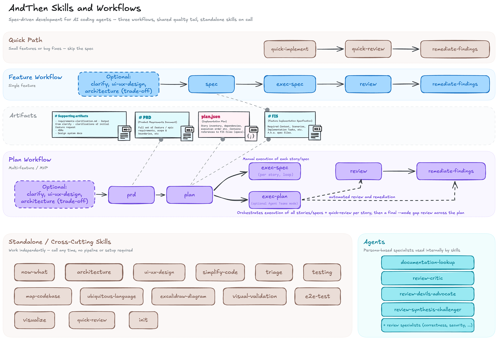

<p align="center">
  
</p>

<p align="center">
  <i>Lightweight spec-driven development for AI coding agents.</i>
</p>

> "I have a feature idea" → *and then?* → **clarify** → *and then?* → **spec** → *and then?* → **exec-spec** → *and then?* → **review** → **ship it.**
>
> Bigger scope? → **clarify** → **prd** → **plan** → **exec-plan** → **review** → **ship it.**

AndThen brings spec-driven development to AI coding agents – lightweight, open, and adoptable piece by piece. The core idea: write a spec before you code, then let the agent execute it autonomously. The pipeline produces a **Feature Implementation Specification (FIS)** as its central artifact – a structured blueprint that turns requirements into reliable, verifiable implementations.

> [!NOTE]
> **This project is an experiment and a work in progress.** We're moving fast and potentially breaking things. APIs, skill interfaces, and artifact formats may change without notice. Feedback is welcome – just know that stability is not yet a goal.

> [!WARNING]
> **Recent breaking changes.** 0.13.0 reshaped the plan and review skill surface; 0.14.0 made `plan` strictly 1:1 with FIS. See [Breaking Changes](plugin/README.md#breaking-changes) in the plugin README for migration tables, or [CHANGELOG.md](CHANGELOG.md) for full notes.

**Gentle adoption, not rigid process.** Use the full pipeline or just the parts you need – `quick-implement` skips specs entirely, `clarify` is optional, every skill works standalone. AndThen is opinionated about *how work flows* from clarified requirements to detailed specs, then `exec-spec`, then `review`, then `remediate-findings` when review turns up real gaps; multi-story plans follow the same underlying loop story-by-story, with `exec-plan` available when you want that flow orchestrated for you (add `--team` for Agent Teams parallelism). `review` runs a single lens per call (code, doc, gap, or mixed) selected automatically or via `--mode`. Skills read a lightweight Document Index in your `CLAUDE.md` to find where specs, plans, and docs live – adapting to your project's structure rather than imposing its own. No mandatory directory layouts, no proprietary formats, no lock-in.

Works as a **Claude Code plugin** with full sub-agent orchestration, and skills are designed to be **agent-agnostic** – falling back to direct execution when sub-agents aren't available.

[Get started →](#installation) · [Skills reference →](#skills)

## Key Concepts

<p align="center">
  
</p>

### Spec-Driven Development

Most AI coding goes straight from idea to code. That works for small fixes, but complex features drift, miss requirements, and produce code that's hard to verify. Spec-driven development adds one step: *write a spec first, then implement against it*. The spec becomes the contract – what to build, how to verify it, and when it's done.

AndThen makes this practical for AI agents without imposing a heavy methodology. You can start with `quick-implement` for small tasks and reach for `spec` when complexity warrants it.

### Feature Implementation Specification (FIS)

The central artifact. A structured document generated by `spec` containing everything needed for autonomous implementation:
- Requirements and acceptance criteria
- Technical approach and architecture
- File changes and dependencies
- Validation checklist

### Workflows

Four paths, pick the one that fits. Every step produces an artifact that the next step consumes — each step suggests the next command with the right path pre-filled.

```
┌─────────────────────────────────────────────────────────────────────┐
│  FEATURE WORKFLOW (single feature)                                  │
│                                                                     │
│  ┌──────────── optional pre-work ─────────────────┐                 │
│  │ ui-ux-design · architecture (trade-off mode)   │                 │
│  └─────────────────────┬──────────────────────────┘                 │
│                        │                                            │
│                        ▼                                            │
│                    [clarify] (optional)                             │
│                        │                                            │
│                        │ requirements-clarification.md              │
│                        ▼                                            │
│                     [spec] ────→ [review] (optional)                │
│                        │                                            │
│                        │ feature.md (FIS)                           │
│                        ▼                                            │
│                   [exec-spec]                                       │
│                        │                                            │
│                        │ implemented code                           │
│                        ▼                                            │
│                     [review] (optional)                             │
│                    (PASS/FAIL)                                      │
│                        │                                            │
│                        └──→ [remediate-findings] (optional)         │
│                                                                     │
│  You drive each step. [review] reports findings;                    │
│  [remediate-findings] applies validated fixes when code is the issue│
└─────────────────────────────────────────────────────────────────────┘

┌─────────────────────────────────────────────────────────────────────┐
│  PLAN WORKFLOW (manual story-by-story loop)                         │
│                                                                     │
│  ┌──────────── optional pre-work ─────────────────┐                 │
│  │ ui-ux-design · architecture (trade-off mode)   │                 │
│  └─────────────────────┬──────────────────────────┘                 │
│                        │                                            │
│                        ▼                                            │
│              [clarify] (optional)                                   │
│                        │                                            │
│                        │ requirements-clarification.md              │
│                        ▼                                            │
│                      [prd]                                          │
│                        │                                            │
│                        │ prd.md                                     │
│                        ▼                                            │
│                     [plan] ────→ [review] (optional)                │
│                        │                                            │
│                        │ plan.md + FIS per story + research         │
│                        ▼                                            │
│                per story: [exec-spec]                               │
│                        │    └──→ optional [review]                  │
│                        │         └──→ [remediate-findings]          │
│                        ▼                                            │
│                     optional final [review]                         │
│                              └──→ [remediate-findings]              │
│                                                                     │
│  You run stories yourself, in plan order, and review when needed.   │
└─────────────────────────────────────────────────────────────────────┘

┌─────────────────────────────────────────────────────────────────────┐
│  PLAN WORKFLOW (automated orchestration)                            │
│                                                                     │
│   optional pre-work (see above)                                     │
│     │                                                               │
│     ▼                                                               │
│  [prd] ───→ [plan] ───→ [exec-plan]                                 │
│                            │                                        │
│                            ├── per story: [exec-spec] → [review]    │
│                            │                                        │
│                            └── after all stories:                   │
│                                 [review --mode gap]                 │
│                                  └──→ [remediate-findings] if needed│
└─────────────────────────────────────────────────────────────────────┘

┌─────────────────────────────────────────────────────────────────────┐
│  QUICK PATH (small features / fixes)                                │
│                                                                     │
│  [quick-implement] ───→ [review] (optional)                         │
│                          └──→ [remediate-findings] (optional)       │
│                                   └──→ done (or PR)                 │
└─────────────────────────────────────────────────────────────────────┘
```

**When to use which:**
- **Quick path** (`quick-implement`): Bug fix, small feature, GitHub issue – you know what to do and it's under ~3 files
- **Feature workflow** (`clarify` → `spec` → `exec-spec` → `review`): Single feature with real complexity – multiple files, non-obvious requirements, needs a blueprint
- **Manual plan workflow** (`clarify` → `prd` → `plan` → per-story `exec-spec`): Multiple features, MVP, or a new project where you want explicit control story by story. `plan` produces the full bundle (`plan.md` + FIS per story); you drive execution story by story with optional per-story or final review/remediation
- **Automated plan workflow** (`clarify` → `prd` → `plan` → `exec-plan`): The same bundle, with implementation orchestrated for you. Use `--team` for Agent Teams parallelism

In both plan workflows, the per-story execution step is handled by `exec-spec`. `plan --skip-specs` is available when you want a cheap planning pass that defers FIS generation.

**Headless orchestration:** the core pipeline skills (`prd`, `plan`, `spec`, `exec-spec`, `exec-plan`, `review`, `quick-review`, `remediate-findings`) and the supporting skills they call into (`architecture`, `ui-ux-design`, `triage`) accept `--auto` / `--headless` for external orchestrators. In this mode, skills do not ask follow-up questions or emit arrow-prompts; they make conservative assumptions, write assumptions/deferred decisions into artifacts, propagate `--auto` to nested `andthen:*` skill calls that accept it (`ops` is exempt — it is deterministic), and stop with `BLOCKED:` on contract failures or unsafe actions. This is intended for systems that already provide deterministic orchestration, such as CI or external agent runners.

Not sure? Start with `quick-implement`. If it feels too complex, switch to the feature workflow. See [Getting Started](#getting-started) for a full walkthrough.

Both `exec-spec` and `quick-implement` use an internal **implement → verify → evaluate** cycle, repeating if needed. Verification includes code review, testing, and visual validation (when applicable).


## Installation

### Claude Code Plugin (recommended)

```bash
# Add marketplace
/plugin marketplace add IT-HUSET/andthen

# Install plugin
/plugin install andthen
```

**Scope options:**
```bash
/plugin install andthen --scope project   # current project only (default: user scope)
```

**Enable auto-update** (recommended): Run `/plugin`, go to the **Marketplaces** tab, select the `andthen` marketplace, and choose **Enable auto-update**.

**Local install** (if you have the repo cloned):
```bash
claude plugin install ./plugin
```

### Other AI Coding Agents (Codex CLI, Aider, Cursor, etc.)

Skills use capability detection and work without the plugin infrastructure. Use the installer to export skills with `andthen-`-prefixed names to the agent skills directory:

```bash
# Install skills, references, and helper scripts
./scripts/install-skills.sh

# Optional overrides
./scripts/install-skills.sh --dry-run
./scripts/install-skills.sh --skills-dir ~/.agents/skills
```

This exports all skills as `andthen-`-prefixed directories (e.g., `andthen-clarify/`, `andthen-prd/`, `andthen-spec/`, `andthen-plan/`, `andthen-review/`). Plugin reference docs, shared templates, and helper scripts are also copied.

Invoke with `/andthen:<skill>` in Claude Code, or `$andthen-<skill>` in Codex and other agents.

If you use a custom `--skills-dir` or `--prefix`, the installer rewrites installed skill references and invocation names automatically.

### Bundling AndThen into a downstream toolkit

Other workflow toolkits (e.g. DartClaw) can pull AndThen in under their own prefix so the two coexist without namespace collisions. The pattern is just clone + install:

```bash
git clone --depth 1 https://github.com/IT-HUSET/andthen /tmp/andthen

# User-tier install (~/.claude/skills, ~/.agents/skills):
/tmp/andthen/scripts/install-skills.sh --prefix dartclaw- --claude-user

# Project-local Claude Code install (target <project>/.claude/):
/tmp/andthen/scripts/install-skills.sh --prefix dartclaw- \
  --claude-skills-dir "$PWD/.claude/skills"
```

Each downstream picks its own `--prefix` (must end with `-`). Skills install as `<prefix><name>` and on Claude Code are invokable as `/<prefix><name>`. The AndThen Claude Code plugin can be installed alongside without conflict as long as the prefixes differ.

`--claude-skills-dir` overrides the Claude-side skill destination and implies a Claude Code user-tier install (no separate `--claude-user` needed). The generic skill target (`--skills-dir`) defaults to `~/.agents/skills`; pass it too if you want a fully project-local bundle.


## Setup

The quickest way to get started:

```bash
/andthen:init
```

This is the single entry point for all project types – new, partial setups, and existing codebases. It interactively generates `CLAUDE.md`, creates selected document types, and copies guidelines. For existing codebases, it offers to run `map-codebase` to auto-generate architecture, stack, and conventions documentation from code analysis.

**Manual setup** – if you prefer to set things up yourself, skills reference your project's `CLAUDE.md` for context. Add these sections:

**1. Project Document Index** – tells skills where to write output (specs, plans, etc.)
**2. Workflow Rules, Guardrails and Guidelines** – behavioral rules and development standards

See [`plugin/skills/init/templates/CLAUDE.template.md`](plugin/skills/init/templates/CLAUDE.template.md) for a starter template.

**Optional project docs** – The Document Index includes optional rows for State, Requirements, Roadmap, Architecture, Conventions, Learnings, and Stack documents. Starter templates for these live in [`plugin/skills/init/templates/project-state-templates.md`](plugin/skills/init/templates/project-state-templates.md). You can also auto-generate Architecture, Conventions, and Stack docs from an existing codebase using `/andthen:map-codebase`.

### Agent Teams (Optional, Claude Code only)

`exec-plan --team` and `review --council --team` use [Agent Teams](https://code.claude.com/docs/en/agent-teams) for enhanced parallel multi-agent coordination with real-time inter-agent communication. Without `--team`, both use sub-agents with sequential fallback and work across all agents. To enable Agent Teams:

```json
// ~/.claude/settings.json
{
  "env": {
    "CLAUDE_CODE_EXPERIMENTAL_AGENT_TEAMS": "1"
  }
}
```


## Getting Started

### Your First Feature

You have a feature idea – maybe just a sentence, maybe a rough description. Here's how the pipeline works in practice.

**Step 0 (optional): Not sure where to start?**

```bash
/andthen:now-what                              # asks what you want to build
/andthen:now-what "add OAuth login"            # already have an idea — route me
```

`now-what` is the first-stop router. It inspects your project state (init'd? greenfield? brownfield? mid-flow?) and points you at the right skill — `init`, `clarify`, `prd`, `architecture`, etc. Useful when you don't yet know whether your work is a single feature, a multi-feature initiative, or something else. Skip it if you already know. If `now-what` routes you to `clarify`, continue with Step 1 below; if it routes elsewhere (`quick-implement`, `triage`, `architecture --mode advise`, etc.), follow that skill's own flow — you've left the "Your First Feature" path.

**Step 1: Clarify requirements** *(interactive)*

```bash
/andthen:clarify "users should be able to export their data"
```

This starts an **interactive conversation**. Claude analyzes your input, identifies gaps, and asks you 3-5 targeted questions at a time – about scope, user flows, edge cases, success criteria. You answer, it asks more. Typically 2-4 rounds until requirements are solid.

Input can be anything: a sentence, a paragraph, a file path (`@docs/feature-idea.md`), or a GitHub issue (`--issue 42`).

When done, you'll have a structured requirements document:
```
docs/specs/data-export/requirements-clarification.md
```

You can also start directly from a GitHub issue:
```bash
/andthen:clarify --issue 42
```

**Optional review checkpoint:** `/andthen:visualize docs/specs/data-export/requirements-clarification.md` opens a browser HTML view of the artifact for review.

**Step 2a: Create a spec** *(single feature)*

```bash
/andthen:spec docs/specs/data-export/
```

This reads your clarified requirements, analyzes the codebase, and produces a **Feature Implementation Specification (FIS)** – the blueprint for autonomous implementation. No code changes happen here.

```
docs/specs/data-export/data-export.md
```

**Step 2b: Or create a plan bundle** *(multi-feature / MVP)*

```bash
# Step 2b-i: Create the PRD (extracts/synthesizes product requirements)
/andthen:prd docs/specs/data-export/
/andthen:prd --issue 42   # or directly from a GitHub issue

# Step 2b-ii: Create the full plan bundle (plan.md + FIS per story + research)
/andthen:plan docs/specs/data-export/
# Cheap planning pass (plan.md only, defer FIS generation):
/andthen:plan --skip-specs docs/specs/data-export/
```

`prd` picks up `requirements-clarification.md` or a draft PRD automatically; `plan` requires `prd.md` and breaks the PRD into sequenced stories with phases and dependencies, plus batch-generates FIS for every story and runs a cross-cutting review.

```
docs/specs/data-export/prd.md
docs/specs/data-export/plan.md
docs/specs/data-export/s01-*.md   (FIS per story)
```

**Step 3: Execute**

```bash
# Single feature:
/andthen:exec-spec docs/specs/data-export/data-export.md

# Multi-feature (manual story-by-story loop — bundle already has FIS per story):
/andthen:exec-spec docs/specs/data-export/s01-story-name.md
# Optional per-story review:
/andthen:review --mode gap docs/specs/data-export/s01-story-name.md
/andthen:remediate-findings <path-to-review-report>   # if review reports actionable gaps
# ...repeat for each story in plan order
# Optional final plan-level review:
/andthen:review --mode gap docs/specs/data-export/plan.md
/andthen:remediate-findings <path-to-review-report>   # if needed after final review

# Multi-feature (automated):
/andthen:exec-plan docs/specs/data-export/

# Claude Code Agent Teams for enhanced parallelism:
/andthen:exec-plan --team docs/specs/data-export/
# Or with worktree isolation for parallel execution:
/andthen:exec-plan --team --worktree docs/specs/data-export/
```

**Step 4: Review**

```bash
# Single feature:
/andthen:review --mode gap <path-to-fis>

# Manual per-story or final multi-feature review:
/andthen:review --mode gap <path-to-plan-or-fis>
```

`exec-plan` runs `quick-review` per story automatically, then a final gap review (`review --mode gap`) on the whole plan. For manual review of individual stories, use `review --mode gap` on the FIS path.

`review` is the default review entrypoint. It runs in code / doc / gap / mixed modes (auto-detected or selected via `--mode`) to answer the right question for the target: code review, document readiness, or requirements-vs-implementation fit.

Review reports published to GitHub (issue or PR comment) can be consumed directly by remediation:
- `/andthen:remediate-findings <review-issue-url-or-pr-comment-url>`

**Step 5: Remediate Findings** *(when review returns actionable gaps)*

```bash
/andthen:remediate-findings <path-to-review-report>
# Or directly from a typed GitHub review artifact:
/andthen:remediate-findings https://github.com/org/repo/issues/789
/andthen:remediate-findings https://github.com/org/repo/pull/456#issuecomment-123
```

This re-validates the findings against the current workspace, applies the smallest safe fixes, re-runs the relevant verification, and updates plan/FIS state when the reviewed work is now complete.

### When to Use `clarify`

`clarify` is optional – but knowing when to use it saves time.

| Your starting point | Recommendation |
|---|---|
| A one-liner or vague idea ("users should be able to export data") | **Use `clarify`** – too many unknowns for a good spec |
| A rough description with some known requirements but unclear scope/edges | **Use `clarify`** – it will focus on gaps, not re-discover what you know |
| Well-defined requirements with acceptance criteria (from a PM, a detailed issue) | **Skip `clarify`** – go straight to `spec --issue 42` or `plan --issue 42` |
| Existing requirements doc or Notion page | **Skip `clarify`** – pass the file/URL directly to `spec` or `plan` |

**Rule of thumb:** If you can't list 3 concrete acceptance criteria for the feature, run `clarify` first.

### `clarify` vs. `prd`'s Built-in Discovery

Both `clarify` and `prd` can do requirements discovery. The difference:

- **`clarify`** does deep, thorough discovery – design space decomposition, domain language extraction, detailed edge case analysis. It's interactive and produces a standalone requirements document.
- **`prd`** does headless synthesis when no prior artifact exists. It focuses on getting enough information to produce a defensible PRD, but won't go as deep on edge cases or design alternatives as `clarify`.

**Use `clarify` first when:** The problem space is genuinely unclear, you're exploring multiple design directions, or the domain is complex. `prd` will pick up the clarified output and skip its own synthesis.

**Skip `clarify` and let `prd` handle it when:** You have a reasonable understanding of what you want – maybe not perfectly documented, but you could explain it in a few paragraphs. `prd`'s headless synthesis will fill the gaps with explicit assumptions.


## Skills

Invoke with `/andthen:<skill>` (e.g. `/andthen:triage`, `/andthen:spec`). For per-skill flag, mode, and option details, see the tables in [`plugin/README.md`](plugin/README.md#skills) — the rows below are intentionally one-liner purpose only.

### Standalone Skills

Use these individually for everyday development — no setup, no pipeline, no prior artifacts needed.

> **Not sure where to start?** Run `/andthen:now-what` — it inspects your project state and routes you to the right skill.

| Skill | Purpose |
|-------|---------|
| `now-what` | First-stop router — inspects project state and routes to the right skill |
| `triage` | Investigate, diagnose, and fix issues |
| `quick-implement` | Fast path for small features/fixes |
| `quick-review` | Quick in-conversation sanity-check via fresh-context sub-agent |
| `review` | Smart review entrypoint — code, docs, spec/requirements alignment, single or multi-perspective |
| `refactor` | Code improvement and simplification |
| `architecture` | Architecture design, review, decomposition, trade-off analysis, ADRs, fitness functions |
| `ui-ux-design` | UI/UX work — research, design systems, wireframes, design review |
| `map-codebase` | Codebase analysis – auto-generates architecture, stack, conventions docs |
| `ubiquitous-language` | Extract and maintain domain glossary from codebase and docs |
| `excalidraw-diagram` | Generate Excalidraw diagram JSON files that make visual arguments |
| `visual-validation` | Validate UI screenshots and implementations against visual, responsive, and design expectations (`andthen:visual-validation` skill) |
| `visualize` | Render PRD / requirements-clarification / trade-off report as a self-contained HTML view with section-anchored notes |
| `e2e-test` | End-to-end browser testing for web applications |
| `testing` | Test strategy, coverage, authoring, and test-first / red-green-refactor discipline |

### Pipeline Skills

These compose into structured workflows — from requirements through implementation to review.

| Skill | Purpose |
|-------|---------|
| `init` | Set up AndThen workflow structure (new projects, partial setups, brownfield) |
| `clarify` | Requirements discovery – from vague idea to structured requirements |
| `prd` | Create a Product Requirements Document from requirements |
| `spec` | Generate Feature Implementation Specification from requirements |
| `exec-spec` | Execute a FIS – direct implementation with validation |
| `plan` | Full plan bundle: story breakdown + FIS for every story + cross-cutting review. Requires `prd.md` input |
| `exec-plan` | Execute a fully-specced plan bundle – exec-spec + quick-review per story, final gap review |
| `remediate-findings` | Implement validated review findings with re-validation and status updates |
| `ops` | Deterministic state management, git conventions, and progress tracking |


## Agents

AndThen ships one agent: the `andthen:documentation-lookup` agent for Claude Code plugin-tier installs only. Other install paths use equivalent skill-prompt routing through the project's `## Documentation Lookup Tools` section.

Architecture, UI/UX design, build/test diagnosis, and visual validation are **skills** — use `/andthen:architecture`, `/andthen:ui-ux-design`, `/andthen:triage`, and `/andthen:visual-validation` where relevant. Research is inline sub-agent guidance embedded in the skill prompts that need it (no standalone skill or agent).


## Docs

### Guidelines (`docs/guidelines/`)

Simplified starting points – copy into your project and adapt to your needs. Workflow skills reference these via your project's `CLAUDE.md`, so you can replace them entirely with your own.

| Guide | Purpose |
|-------|---------|
| `DEVELOPMENT-ARCHITECTURE-GUIDELINES.md` | Development standards and architecture patterns |
| `UX-UI-GUIDELINES.md` | UX/UI design guidelines |
| `WEB-DEV-GUIDELINES.md` | Web development best practices |
| `CRITICAL-RULES-AND-GUARDRAILS.md` | Safety rules and behavioral guardrails for AI agents |

### Reference (`docs/`)

| Document | Purpose |
|----------|---------|
| `MODEL-EFFORT-SELECTION-GUIDE.md` | Model and thinking effort selection guide |

### Starter Templates (`plugin/skills/init/templates/`)

Canonical user-facing starter templates (owned by the `init` skill — see ownership table in `CLAUDE.md`).

| Document | Purpose |
|----------|---------|
| `CLAUDE.template.md` | Starter template for project `CLAUDE.md` |
| `project-state-templates.md` | Starter templates for STATE.md, PRODUCT-BACKLOG.md, ROADMAP.md, etc. |


## Hooks

Optional standalone Claude Code hooks for safety and productivity. See [`hooks/README.md`](hooks/README.md) for setup.

| Hook | Event | Purpose |
|------|-------|---------|
| `block-dangerous-commands.py` | PreToolUse | Blocks destructive shell commands (rm -rf, fork bombs, pipe-to-shell, etc.) |
| `notify.sh` | Stop, Notification | Desktop notifications when Claude finishes or needs attention |
| `notify-elevenlabs.sh` | Stop, Notification | Voice notifications via ElevenLabs TTS API |
| `reinject-context.sh` | SessionStart | Re-injects critical rules after context compaction |


## Other useful resources (skills, plugins etc)

- Agent Browser (CLI tool and Skill) - https://github.com/vercel-labs/agent-browser

- Other useful plugins from the official marketplace ([anthropics/claude-plugins-official](https://github.com/anthropics/claude-plugins-official)):
  - [`semgrep`](https://github.com/semgrep/mcp-marketplace) - external but officially recommended
  - `playground`
  - `claude-md-management`


## Evolved From

AndThen evolved from [cc-workflows](https://github.com/tolo/claude_code_common) – a general-purpose AI coding agent toolkit.


## Inspired by _(name)_

[](https://www.youtube.com/watch?v=oqwzuiSy9y0)

and then

[](https://www.youtube.com/watch?v=fPzvUW8qaWY)


## Actually inspired by

Too many to list, but special shoutout to:
- [Peter Steinberger](https://github.com/steipete)
- [Cole Medin](https://github.com/coleam00)
- [IndieDevDan](https://github.com/disler)
- [Matt Maher](https://github.com/bladnman)
- [Mario Zechner](https://github.com/badlogic)
- [Matt Pocock](https://github.com/mattpocock)


## License

MIT
