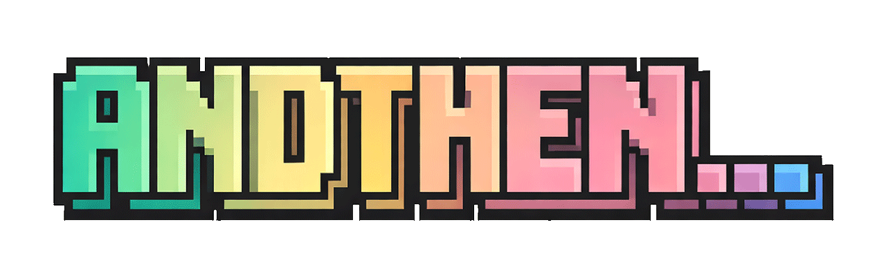

<p align="center">
  
</p>

<p align="center">
  Structured workflows for agentic development — from requirements to shipped code.
</p>

> "I have a feature idea" → *and then?* → clarify → *and then?* → spec → *and then?* → plan → *and then?* → execute → *and then?* → review-gap → **ship it.**

AndThen is a workflow system for AI coding agents. It provides structured skills that guide development through a disciplined pipeline, producing a **Feature Implementation Specification (FIS)** as the core artifact — a comprehensive blueprint that enables reliable, autonomous implementation.

**Structured process, flexible project.** AndThen is opinionated about *how work flows* (clarify → spec → plan → execute → review) but not about *how your project is organized*. Skills read a lightweight Document Index in your `CLAUDE.md` to find where specs, plans, and docs live — adapting to your project's structure rather than imposing its own. No mandatory directory layouts, no config files, no lock-in.

Works as a **Claude Code plugin** with full sub-agent orchestration, and skills are designed to be **agent-agnostic** — falling back to direct execution when sub-agents aren't available.


## Installation

### Claude Code Plugin (recommended)

```bash
# Add marketplace
/plugin marketplace add IT-HUSET/andthen

# Install plugin
/plugin install andthen
```

**Scope options:**
```bash
/plugin install andthen --scope project   # current project only (default: user scope)
```

**Enable auto-update** (recommended): Run `/plugin`, go to the **Marketplaces** tab, select the `andthen` marketplace, and choose **Enable auto-update**.

**Local install** (if you have the repo cloned):
```bash
claude plugin install ./plugin
```

### Other AI Coding Agents (Codex CLI, Aider, Cursor, etc.)

Skills use capability detection and work without the plugin infrastructure. Use the installer to export skills with `andthen.`-prefixed names to the agent skills directory:

```bash
# Install to ~/.agents/skills/ (default)
./scripts/install-skills.sh

# Optional overrides
./scripts/install-skills.sh --dry-run
./scripts/install-skills.sh --skills-dir ~/.agents/skills
```

This exports all skills as `andthen.`-prefixed directories (e.g., `andthen.clarify/`, `andthen.spec/`, `andthen.review-code/`). Plugin reference docs are also copied. Agent Teams skills (`exec-plan-team`, `review-council-team`) are excluded since they require Claude Code.

In Claude Code, invoke with `/andthen:<skill>`. In Codex and other agents, use `$andthen.<skill>` or `/andthen.<skill>`.


## Setup

The quickest way to get started:

```bash
/andthen:init
```

This interactively sets up your project — generates `CLAUDE.md`, creates selected document types, and copies guidelines. Works for new projects, partial setups, and brownfield codebases.

**Manual setup** — if you prefer to set things up yourself, skills reference your project's `CLAUDE.md` for context. Add these sections:

**1. Project Document Index** — tells skills where to write output (specs, plans, etc.)
**2. Workflow Rules, Guardrails and Guidelines** — behavioral rules and development standards

See [`templates/CLAUDE.template.md`](templates/CLAUDE.template.md) for a starter template.

**Optional project docs** — The Document Index includes optional rows for State, Requirements, Roadmap, Architecture, Conventions, Learnings, and Stack documents. Starter templates for these are in [`templates/project-state-templates.md`](templates/project-state-templates.md). You can also auto-generate Architecture, Conventions, and Stack docs from an existing codebase using `/andthen:map-codebase`.

### Agent Teams (Optional, Claude Code only)

The `-team` skill variants (`exec-plan-team`, `review-council-team`) use [Agent Teams](https://code.claude.com/docs/en/agent-teams) for enhanced parallel multi-agent coordination with real-time inter-agent communication. The portable versions (`exec-plan`, `review-council`) work across all agents using sub-agents with sequential fallback. To enable Agent Teams:

```json
// ~/.claude/settings.json
{
  "env": {
    "CLAUDE_CODE_EXPERIMENTAL_AGENT_TEAMS": "1"
  }
}
```


## Workflow Overview

```
┌─────────────────────────────────────────────────────────────┐
│  FEATURE WORKFLOW (single feature)                          │
│                                                             │
│  ┌─────────────────────── OPTIONAL: ─────────────────────┐  │
│  │ wireframes, design-system, trade-off                  │  │
│  └───────────────────────────┬───────────────────────────┘  │
│                              │                              │
│  (optional)                  ▼          (optional)          │
│  clarify ──────────────→   spec   ────→ review-doc          │
│                              │                              │
│                              ▼                              │
│                          exec-spec                          │
│                              │                              │
│                              ▼                              │
│                        review-gap                           │
└─────────────────────────────────────────────────────────────┘

┌─────────────────────────────────────────────────────────────┐
│  PLAN WORKFLOW (MVP / multi-feature)                        │
│                                                             │
│  ┌──────────────── OPTIONAL PRE-WORK: ─────────────────┐    │
│  │ wireframes, design-system, trade-off                │    │
│  └───────────────────────┬─────────────────────────────┘    │
│                          │                                  │
│  (optional)              ▼            (optional)            │
│  clarify ──────→  plan  ──────→  review-doc                 │
│             (PRD + story breakdown)                         │
│                          │                                  │
│              ┌───────────┴───────────┐                      │
│              ▼                       ▼                      │
│         exec-plan              Per story:                   │
│       (sub-agent              spec → exec-spec → review-gap │
│        pipeline)              (repeat for each story)       │
│              └───────────┬───────────┘                      │
│                          ▼                                  │
│                      review-gap                             │
└─────────────────────────────────────────────────────────────┘

┌─────────────────────────────────────────────────────────────┐
│  QUICK PATH (small features/fixes)                          │
│                                                             │
│  quick-implement ──→ review-gap (optional) ──→ done (or PR) │
└─────────────────────────────────────────────────────────────┘
```

**When to use which:**
- **Feature workflow**: Single feature, complex changes, multi-file modifications
- **Plan workflow**: MVP, new project, multi-feature work
- **Quick path**: Bug fixes, small features, GitHub issues


## Skills

In Claude Code, invoke with `/andthen:<skill>`. In Codex and other agents, use `$andthen.<skill>` or `/andthen.<skill>`.

### Core Skills

| Skill | Purpose |
|-------|---------|
| `init` | Set up AndThen workflow structure (new projects, partial setups, brownfield) |
| `clarify` | Requirements discovery — from vague idea to structured requirements |
| `spec` | Generate Feature Implementation Specification from requirements |
| `exec-spec` | Execute a FIS — orchestrated implementation with validation |
| `review-gap` | Gap analysis + code review against requirements |
| `plan` | Requirements discovery + PRD creation (if needed) + story breakdown |
| `trade-off` | Architecture decision research with evidence-based recommendations |
| `review-code` | Code review with checklists (quality, security, architecture, UI/UX) |
| `review-doc` | Document review for completeness, clarity, and technical accuracy |

### Extras

| Skill | Purpose |
|-------|---------|
| `exec-plan` | Execute plan — sub-agent pipeline (spec → exec-spec → review-gap per story) |
| `quick-implement` | Fast path for small features/fixes (supports `--issue` for GitHub) |
| `e2e-test` | End-to-end browser testing for web applications |
| `ops` | Deterministic state management, git conventions, and progress tracking |
| `design-system` | Create design tokens and component styles |
| `wireframes` | Generate HTML wireframes for UI planning |
| `refactor` | Code improvement and simplification |
| `review-council` | Multi-perspective review (5-7 reviewers + adversarial debate) |
| `triage` | Investigate, diagnose, and fix issues (`--plan-only` for investigation only) |
| `ubiquitous-language` | Extract and maintain domain glossary from codebase and docs |
| `map-codebase` | Brownfield codebase analysis + reverse requirements discovery |

### Agent Teams Variants (Claude Code only)

| Skill | Purpose |
|-------|---------|
| `exec-plan-team` | Execute plan via Agent Team pipeline with inter-agent coordination |
| `review-council-team` | Multi-perspective review with real-time Agent Teams debate |


## Key Concepts

### Feature Implementation Specification (FIS)

The core artifact. A structured document generated by `spec` containing everything needed for autonomous implementation:
- Requirements and acceptance criteria
- Technical approach and architecture
- File changes and dependencies
- Validation checklist

### The AndThen Pipeline

The philosophy: every step naturally leads to the next. *"And then?"* forces structured progression rather than ad-hoc development.

```
clarify → spec → plan → execute → review-gap
   ↑                                  │
   └──────── feedback loop ───────────┘
```

### Implementation Loop

Both `exec-spec` and `quick-implement` use an iterative cycle:
```
Implement → Verify → Evaluate → (repeat if needed)
```

Verification includes code review, testing, and visual validation (when applicable).


## Agents

Specialized sub-agents used internally by skills:

| Agent | Purpose |
|-------|---------|
| `research-specialist` | Web research and synthesis |
| `solution-architect` | Architecture design and technical decisions |
| `qa-test-engineer` | Test coverage and validation |
| `documentation-lookup` | External documentation retrieval |
| `build-troubleshooter` | Build/test failure diagnosis |
| `ui-ux-designer` | UI/UX design and prototyping |
| `visual-validation-specialist` | Visual validation workflow |


## Docs

### Guidelines (`docs/guidelines/`)

Simplified starting points — copy into your project and adapt to your needs. Workflow skills reference these via your project's `CLAUDE.md`, so you can replace them entirely with your own.

| Guide | Purpose |
|-------|---------|
| `DEVELOPMENT-ARCHITECTURE-GUIDELINES.md` | Development standards and architecture patterns |
| `UX-UI-GUIDELINES.md` | UX/UI design guidelines |
| `WEB-DEV-GUIDELINES.md` | Web development best practices |
| `CRITICAL-RULES-AND-GUARDRAILS.md` | Safety rules and behavioral guardrails for AI agents |

### Reference (`docs/`)

| Document | Purpose |
|----------|---------|
| `MODEL-EFFORT-SELECTION-GUIDE.md` | Model and thinking effort selection guide |

### Reference (`plugin/references/`)

| Document | Purpose |
|----------|---------|
| `verification-patterns.md` | Stub detection, wiring checks, and the Nyquist verification principle |

### Templates (`templates/`)

| Document | Purpose |
|----------|---------|
| `CLAUDE.template.md` | Starter template for project `CLAUDE.md` |
| `project-state-templates.md` | Starter templates for STATE.md, REQUIREMENTS.md, ROADMAP.md, etc. |


## Hooks

Optional standalone Claude Code hooks for safety and productivity. See [`hooks/README.md`](hooks/README.md) for setup.

| Hook | Event | Purpose |
|------|-------|---------|
| `block-dangerous-commands.py` | PreToolUse | Blocks destructive shell commands (rm -rf, fork bombs, pipe-to-shell, etc.) |
| `notify.sh` | Stop, Notification | Desktop notifications when Claude finishes or needs attention |
| `notify-elevenlabs.sh` | Stop, Notification | Voice notifications via ElevenLabs TTS API |
| `reinject-context.sh` | SessionStart | Re-injects critical rules after context compaction |


## External Dependencies (Optional)

These plugins are available from the official Claude plugins marketplace ([anthropics/claude-plugins-official](https://github.com/anthropics/claude-plugins-official)). Some skills optionally use skills from other plugins when available:

| Plugin | Used by | Purpose |
|--------|---------|---------|
| `code-simplifier` | `refactor`, `exec-spec`, `quick-implement` | Code cleanup and simplification |
| `frontend-design` | `wireframes` (via `ui-ux-designer` agent) | Design implementation |

Skills work without these plugins but skip the corresponding steps.


## Other useful resources (skills, plugins etc)

- Agent Browser (CLI tool and Skill) - https://github.com/vercel-labs/agent-browser

- Excalidraw Diagram Creator Skill - https://github.com/coleam00/excalidraw-diagram-skill/blob/main/SKILL.md


## Evolved From

AndThen evolved from [cc-workflows](https://github.com/tolo/claude_code_common) — a general-purpose AI coding agent toolkit.


## Inspired by

[](https://www.youtube.com/watch?fPzvUW8qaWY)

and then

[](https://www.youtube.com/watch?oqwzuiSy9y0)


## Actually inspired by

Too many to list, but special shoutout to:
- [Peter Steinberger](https://github.com/steipete)
- [Cole Medin](https://github.com/coleam00)
- [IndieDevDan](https://github.com/disler)
- [Matt Maher](https://github.com/bladnman)
- [Mario Zechner](https://github.com/badlogic)
- [Matt Pocock](https://github.com/mattpocock)


## License

MIT
