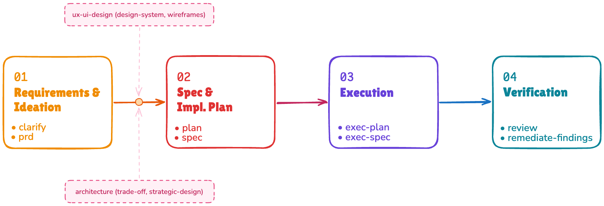

<p align="center">
  
</p>

<p align="center">
  <i>Lightweight spec-driven development for AI coding agents.</i>
</p>

> "I have a feature idea" → *and then?* → **clarify** → *and then?* → **spec** → *and then?* → **exec-spec** → *and then?* → **review** → **ship it.**
>
> Bigger scope? → **clarify** → **prd** → **plan** → **exec-plan** → **review** → **ship it.**

AndThen brings spec-driven development to AI coding agents – lightweight, open, and adoptable piece by piece. The core idea: **write a spec before you code, then let the agent execute it autonomously.**

- **Works everywhere** – as a Claude Code plugin, and with Codex CLI / other agents via an installer.
- **Skills are the unit of work** – invoke `andthen:<name>` for just the step you need.
- **No mandatory directories or proprietary formats** – skills read a lightweight Document Index in your `CLAUDE.md` / `AGENTS.md` to find where your specs, plans, and docs live, adapting to your project rather than imposing a structure on it.
- **Gentle adoption, not rigid process** – every skill works standalone (`quick-implement` skips specs entirely, `review` runs on its own). AndThen is opinionated about *how work flows* – requirements → spec → implementation → review – but never forces you onto the whole path.

In a hurry? In Claude Code:

```bash
/plugin marketplace add IT-HUSET/andthen
/plugin install andthen
/andthen:init        # set up your project
/andthen:now-what    # ...and let it route you from there
```

> [!NOTE]
> **This project is an experiment and a work in progress.** We're moving fast and potentially breaking things. APIs, skill interfaces, and artifact formats may change without notice. Feedback is welcome – just know that stability is not yet a goal. For breaking changes between releases, see [Migration Notes](plugin/README.md#migration-notes) and [CHANGELOG.md](CHANGELOG.md).

[Installation →](#installation) · [Getting started →](#getting-started) · [Skills →](#skills) · [Full skill reference (flags, modes) →](plugin/README.md)


## What AndThen Gives You

<p align="center">
  <a href="assets/workflows-overview.png"></a>
</p>

### Spec-driven development

Most AI coding goes straight from idea to code. That works for small fixes, but complex features drift, miss requirements, and produce code that's hard to verify. Spec-driven development adds one step: *write a spec first, then implement against it*. The spec becomes the contract – what to build, how to verify it, and when it's done. AndThen makes this practical for AI agents without a heavy methodology: start with `quick-implement` for small tasks, reach for `spec` when complexity warrants it.

### The Feature Implementation Specification (FIS)

The central artifact, generated by `spec`. A structured document with everything needed for autonomous implementation: the feature's **intent and expected outcomes**, **acceptance scenarios** (BDD-style), structural criteria, scope boundaries (what we're *not* doing), the technical approach and architecture decision, and the task breakdown. `exec-spec` implements against it and attests completion scenario-by-scenario.

### Built-in review and verification

`exec-spec` and `quick-implement` run an internal **implement → verify → evaluate** loop (build, tests, lint, and visual validation where applicable), repeating until the work holds. `review` then gives you a focused review pass – code, docs, spec-vs-implementation gap, or security – before you ship. Findings flow into `remediate-findings`, which applies the smallest safe fixes and re-validates.


## The Workflows

<p align="center">
  <a href="assets/skills-overview.png"></a>
</p>

Four paths, pick the one that fits the size of the work. Every step produces an artifact the next step consumes, and each step suggests the next command with the right path pre-filled.

**1. Quick path** – for a bug fix or small feature you can describe in a sentence.
```
quick-implement → (optional) quick-review → (optional) remediate-findings
```

**2. Feature workflow** – one feature with real complexity. Produces a FIS as the blueprint.
```
(optional pre-work) → spec → exec-spec → (optional) review → (optional) remediate-findings
```

**3. Plan workflow (manual)** – a multi-feature initiative or MVP, driven story by story.
```
(optional pre-work) → prd → plan → per story: exec-spec → (optional) review → remediate-findings
```
`plan` produces `plan.json` plus one FIS per story; you execute each story yourself.

**4. Plan workflow (automated)** – same up to `plan`, then let `exec-plan` orchestrate it.
```
(optional pre-work) → prd → plan → exec-plan
```
`exec-plan` runs `exec-spec` + `quick-review` for each story, then a final gap review across the whole plan. Add `--team` for [Agent Teams](#agent-teams-optional-claude-code-only) parallelism (Claude Code).

> **Not sure which path?** Start with `quick-implement`. If it feels too complex, switch to the feature workflow. Or run `/andthen:now-what` – it inspects your project state and routes you.

### Optional pre-work

Before `spec` or `prd`, supporting skills sharpen the input when the problem isn't yet clear:

- **`clarify`** – interactive requirements discovery. Turns a fuzzy idea into solid requirements by probing gaps, edge cases, scope boundaries, and alternatives. Runs at **feature scope** (default → `requirements-clarification.md`) or **product scope** (`--mode product` → `PRODUCT.md`, for vision/personas/anti-goals before features are planned).
- **`architecture`** – design and analysis across seven modes (no code changes). Most relevant here: **`--mode trade-off`** compares competing options (e.g. *"SQL vs document DB for the events store"*) and produces an evidence-based recommendation plus an ADR; **`--mode strategic-design`** and **`--mode event-storming`** carve domain boundaries before a multi-feature `prd`. Full mode list in the [skill reference](plugin/README.md#architecture-modes).
- **`ui-ux-design`** – research, design systems, wireframes, and design review when UI work is in scope.

`clarify` → `prd` is a **pipeline, not a choice**: `clarify` does the deep discovery; `prd` synthesizes its output (or does shallower bounded synthesis from raw input) into a PRD. See [When to clarify](#when-to-clarify).

### Headless / automation mode

The core pipeline and standalone execution/review skills accept `--auto` for external orchestrators (CI, agent runners): no follow-up questions, conservative assumptions written into artifacts, and a hard `BLOCKED:` stop on contract failures or unsafe actions. See [plugin/README.md](plugin/README.md#workflows) for the full contract.


## Installation

### Claude Code plugin (recommended)

```bash
/plugin marketplace add IT-HUSET/andthen   # add marketplace
/plugin install andthen                    # install (user scope; add --scope project for current project only)
```

**Enable auto-update** (recommended): run `/plugin`, open the **Marketplaces** tab, select `andthen`, and choose **Enable auto-update**.

### Other agents (Codex CLI, Aider, Cursor)

Skills use capability detection and work without the plugin infrastructure. The installer exports skills under `andthen-`-prefixed names to your agent's skills directory, generates Codex agents, and copies reference docs, shared templates, and helper scripts:

```bash
# Install skills, generated Codex agents, references, and helper scripts
./scripts/install-skills.sh

# Optional overrides
./scripts/install-skills.sh --dry-run                      # preview planned operations; may create relative dirs
./scripts/install-skills.sh --skills-dir ~/.agents/skills  # custom skills directory
./scripts/install-skills.sh --codex-agents-dir ~/.codex/agents
./scripts/install-skills.sh --no-codex-agents              # skip Codex agent generation
```

- Invoke with `/andthen:<skill>` in Claude Code, or `$andthen-<skill>` in Codex and other agents.
- Custom `--skills-dir` or `--prefix`? The installer rewrites installed skill references and invocation names automatically.
- Reinstalls overwrite matching generated files but do not delete stale `<prefix>*.toml` agent files – remove old generated agents manually if you need the agent set to match the current release exactly.

> Pulling AndThen into another toolkit under its own prefix? See [Bundling into a downstream toolkit](plugin/README.md#bundling-into-a-downstream-toolkit).


## Setup

The quickest way to get started:

```bash
/andthen:init
```

The single entry point for all project types – new, partial setups, and existing codebases. It interactively generates `CLAUDE.md` / `AGENTS.md`, scaffolds Core orientation docs (Product, Architecture, Stack, Key Dev Commands, Decisions, Learnings), and copies starter guidelines. For existing codebases it offers to run `map-codebase`, which auto-generates architecture, stack, commands, conventions, and discovered-requirements docs from code analysis.

**Manual setup** – skills read two sections from your root agent instruction file (`CLAUDE.md` / `AGENTS.md`): a **Project Document Index** (where skills write specs, plans, etc.) and **Project-Specific Guidelines**. See [`plugin/skills/init/templates/CLAUDE.template.md`](plugin/skills/init/templates/CLAUDE.template.md) for a starter, and [plugin/README.md](plugin/README.md#setup) for the foundational-guardrails wiring options.

### Agent Teams (optional, Claude Code only)

`exec-plan --team` and `review --council --team` use [Agent Teams](https://code.claude.com/docs/en/agent-teams) for parallel multi-agent coordination with real-time inter-agent communication. `review --council` auto-detects Agent Teams when available even without `--team`; `exec-plan` uses Agent Teams only when `--team` is set. Without Agent Teams, both fall back to sub-agents and work across all agents. To enable:

```json
// ~/.claude/settings.json
{ "env": { "CLAUDE_CODE_EXPERIMENTAL_AGENT_TEAMS": "1" } }
```


## Getting Started

A walkthrough of the feature workflow, from idea to shipped.

**Step 0 (optional) – not sure where to start?**

```bash
/andthen:now-what                       # asks what you want to build, then routes you
/andthen:now-what "add OAuth login"     # already have an idea – route me
```

`now-what` inspects your project state (init'd? greenfield? brownfield? mid-flow?) and points you at the right skill. Skip it if you already know.

**Step 1 – clarify requirements** *(interactive, optional)*

```bash
/andthen:clarify "users should be able to export their data"
/andthen:clarify --issue 42             # start from a GitHub issue
```

An interactive conversation: Claude analyzes your input, identifies gaps, and asks 3–5 targeted questions per round (scope, flows, edge cases, success criteria). Typically 2–4 rounds. Produces `docs/specs/data-export/requirements-clarification.md`.

> **Review checkpoint:** `/andthen:visualize <artifact>` opens a self-contained HTML view of any artifact in your browser for review, with section-anchored notes that round-trip back to the owning skill. Producer skills also accept `--visual` as a handoff after they write their artifact.

**Step 2a – create a spec** *(single feature)*

```bash
/andthen:spec docs/specs/data-export/
```

Reads your clarified requirements, analyzes the codebase, and produces the FIS at `docs/specs/data-export/data-export.md`. No code changes happen here.

**Step 2b – or create a plan bundle** *(multi-feature / MVP)*

```bash
/andthen:prd docs/specs/data-export/    # PRD from requirements (or --issue 42)
/andthen:plan docs/specs/data-export/   # plan.json + one FIS per story
```

`prd` picks up `requirements-clarification.md` (or a draft PRD) automatically; `plan` requires `prd.md` and breaks it into sequenced stories with phases and dependencies, batch-generating a FIS per story plus a cross-cutting consistency review.

**Step 3 – execute**

```bash
# Single feature:
/andthen:exec-spec docs/specs/data-export/data-export.md

# Multi-feature, manual (story by story – the bundle already has a FIS per story):
/andthen:exec-spec docs/specs/data-export/s01-story-name.md
# ...repeat for each story in plan order

# Multi-feature, automated:
/andthen:exec-plan docs/specs/data-export/
/andthen:exec-plan --team docs/specs/data-export/   # enhanced parallelism (Claude Code)
```

**Step 4 – review**

```bash
/andthen:review --mode gap <path-to-fis-or-plan.json>   # single lens
/andthen:review --mode gap,code,security <path>         # chain several lenses in one run
```

`review` is the default review entrypoint. It runs the right lens for the target – `code`, `doc`, `gap` (spec-vs-implementation), or `security` – auto-detected or selected via `--mode`, with comma-separated chains consolidated into a single report. `--council` adds a multi-perspective adversarial layer on top. `exec-plan` already reviews each story and runs a final gap review, so this step is for manual or final checks.

**Step 5 – remediate findings** *(when review returns actionable gaps)*

```bash
/andthen:remediate-findings <path-to-review-report>
/andthen:remediate-findings https://github.com/org/repo/pull/456#issuecomment-123   # or a GitHub review artifact
```

Re-validates findings against the current workspace, applies the smallest safe fixes, re-runs verification, and updates plan/FIS state when the reviewed work is complete.

### When to clarify

`clarify` is optional. `prd` is **not** a second discovery tool – it's the synthesizer downstream of `clarify`. So the question is just *how much discovery the input needs*:

| Your starting point | What to do |
|---|---|
| One-liner or vague idea | **Run `clarify`** – too many unknowns for a good spec or PRD |
| Rough description, unclear scope/edges | **Run `clarify`** – it focuses on gaps, not what you already know |
| You can explain it in a few paragraphs | **Skip to `spec` / `prd`** – `prd`'s bounded synthesis fills gaps with explicit assumptions |
| Well-defined requirements (PM doc, detailed issue, Notion page) | **Skip `clarify`** – pass the file/URL/`--issue` straight to `spec` or `prd` |

**Rule of thumb:** if you can't list 3 concrete acceptance criteria, run `clarify` first. When you do run it, `prd` picks up its output and skips its own synthesis.


## Skills

Invoke with `/andthen:<skill>` (e.g. `/andthen:spec`). The rows below are one-line purposes – for flags, modes, and edge-case behavior, see the full reference in [`plugin/README.md`](plugin/README.md#skills).

> **Not sure where to start?** Run `/andthen:now-what` – it inspects your project state and routes you to the right skill.

### Pipeline skills

These compose into the workflows above – from requirements through implementation to review.

| Skill | Purpose |
|-------|---------|
| `init` | Set up AndThen workflow structure (new projects, partial setups, brownfield) |
| `clarify` | Interactive requirements discovery at feature or product scope (`--mode product\|feature`) |
| `prd` | Synthesize a Product Requirements Document from clarified requirements, a draft, file, URL, or issue; includes fresh-context doc self-review |
| `plan` | Turn a local or GitHub-sourced PRD into a plan bundle: typed `plan.json` + one on-disk FIS per story + cross-cutting review |
| `spec` | Generate a Feature Implementation Specification (FIS) for one execution-sized feature; includes fresh-context doc self-review |
| `exec-spec` | Implement a FIS – code, tests, verification, completion attestation, and reconciliation notes when upstream docs go stale |
| `exec-plan` | Execute a plan bundle story-by-story (`exec-spec` + `quick-review` each, final gap review, reconciliation rollup); `--team` for Agent Teams |
| `preflight` | Drive a FIS or plan bundle to zero open blocking decisions before an unattended `exec-spec`/`exec-plan` run – interactively interviews each blocking decision, persists by altitude, and emits a machine-stable `READY`/`DEFERRED`/`BLOCKED` verdict |
| `remediate-findings` | Apply validated review findings with the smallest safe fixes, re-validate, update state and ledger entries |
| `ops` | Deterministic state (shared + local), plan/FIS, story ownership, reconciliation ledger, and git operations (status, checkboxes, commits) |

### Standalone skills

Use these on their own for everyday development – no setup, no pipeline, no prior artifacts.

| Skill | Purpose |
|-------|---------|
| `now-what` | First-stop router – inspects project state and routes to the right skill |
| `handoff` | Compact the conversation into a resumable handoff doc; routes durable state to `STATE.md` / `STATE.local.md` / `LEARNINGS.md` via `ops` |
| `triage` | Investigate, diagnose, and fix issues – build failures, config errors, runtime bugs, regressions (`--plan-only` to plan without fixing) |
| `quick-implement` | Fast path for small features/fixes/issues, with verification (`--tdd`, `--issue`, `--pr`, `--auto`) |
| `quick-review` | Lightweight mid-conversation Critic review of recent changes in fresh context (`--fix` applies Fix-bucket findings only) |
| `review` | Default review entrypoint – `code` / `doc` / `gap` / `security` / mixed lenses, optional `--council` debate, optional `--fix` |
| `explain-changes` | Explain a PR, branch, or changeset as a narrative walkthrough – intent-grouped changes, key hunks, architectural delta – rendered as an interactive HTML tour |
| `simplify-code` | Behavior-preserving code simplification and cleanup (intent-bounded) |
| `architecture` | Design, review, decomposition, trade-off analysis, ADRs, fitness functions, strategic design, event storming (seven modes) |
| `ui-ux-design` | UI/UX work – research, design systems, wireframes, design review (four modes) |
| `testing` | Test strategy, coverage, authoring, and TDD / red-green-refactor / Prove-It discipline |
| `e2e-test` | End-to-end browser testing for web apps – journey discovery, execution, responsive validation |
| `visual-validation` | Validate UI implementations against design references, baselines, and responsive requirements |
| `map-codebase` | Analyze an existing codebase – generates architecture, stack, commands, conventions, discovered requirements/decisions |
| `ubiquitous-language` | Extract and maintain the project's domain glossary from code and docs |
| `excalidraw-diagram` | Generate high-quality Excalidraw diagrams (conceptual or technical) |
| `visualize` | Render any AndThen artifact as a self-contained HTML review surface with section-anchored notes |
| `refactor` | Deprecated alias – redirects to `simplify-code` (legacy invocations only) |


## Agents

AndThen ships a small agent set:

- Plugin-tier `documentation-lookup` agent for documentation retrieval.
- Plugin-tier `research` agent for web and project research, multi-source verification, and trade-off option investigation.
- Review persona agents for council and Critic review: `review-critic`, `review-devils-advocate`, `review-synthesis-challenger`, plus focused correctness, security, architecture, testing, project-standards, product-requirements, and agent-workflow reviewers.

Agent names are tier-specific: the Claude Code plugin uses unprefixed names (`documentation-lookup`, `review-critic`, …); Codex and Claude user-tier installs generate prefixed names (`andthen-documentation-lookup`, or `<custom-prefix>review-critic`).

Everything else – architecture, UI/UX design, triage, visual validation, artifact review – is a **skill**, not an agent: see the [Skills](#skills) tables above.


## Docs

### Guidelines (`docs/guidelines/`)

Simplified starting points – copy into your project and adapt. Workflow skills reference these via your `CLAUDE.md` / `AGENTS.md`, so you can replace them with your own. Canonical files live in `plugin/skills/init/templates/guidelines/`; `docs/guidelines/` is a symlink to that directory so there's one source of truth.

| Guide | Purpose |
|-------|---------|
| `DEVELOPMENT-ARCHITECTURE-GUIDELINES.md` | Development standards and architecture patterns |
| `UX-UI-GUIDELINES.md` | UX/UI design guidelines |
| `WEB-DEV-GUIDELINES.md` | Web development best practices |
| `CRITICAL-RULES-AND-GUARDRAILS.md` | Safety rules and behavioral guardrails for AI agents |

### Starter templates

Canonical user-facing starter templates (owned by the `init` skill).

| Template | Purpose |
|----------|---------|
| `plugin/skills/init/templates/CLAUDE.template.md` | Starter for project `CLAUDE.md` / `AGENTS.md` |
| `plugin/skills/init/templates/guidelines/` | Starter guideline files copied by `init` |
| `plugin/references/project-state-templates.md` | Starter templates for STATE.md, ROADMAP.md, etc. |

Other reference docs: [`docs/MODEL-EFFORT-SELECTION-GUIDE.md`](docs/MODEL-EFFORT-SELECTION-GUIDE.md) (model and thinking-effort selection).


## Hooks

Optional standalone Claude Code hooks for safety and productivity. See [`hooks/README.md`](hooks/README.md) for setup.

| Hook | Event | Purpose |
|------|-------|---------|
| `block-dangerous-commands.py` | PreToolUse | Blocks destructive shell commands (rm -rf, fork bombs, pipe-to-shell, etc.) |
| `notify.sh` | Stop, Notification | Desktop notifications when Claude finishes or needs attention |
| `notify-elevenlabs.sh` | Stop, Notification | Voice notifications via ElevenLabs TTS API |
| `reinject-context.sh` | SessionStart | Re-injects critical rules after context compaction |


## Other useful resources

- Agent Browser (CLI tool and skill) – https://github.com/vercel-labs/agent-browser
- Other useful plugins from the official marketplace ([anthropics/claude-plugins-official](https://github.com/anthropics/claude-plugins-official)): [`semgrep`](https://github.com/semgrep/mcp-marketplace) (external but officially recommended), `playground`, `claude-md-management`.


## Evolved From

AndThen evolved from [cc-workflows](https://github.com/tolo/claude_code_common) – a general-purpose AI coding agent toolkit.


## Inspired by _(name)_

[](https://www.youtube.com/watch?v=oqwzuiSy9y0)

and then

[](https://www.youtube.com/watch?v=fPzvUW8qaWY)


## Actually inspired by

Too many to list, but special shoutout to:
- [Peter Steinberger](https://github.com/steipete)
- [Cole Medin](https://github.com/coleam00)
- [IndieDevDan](https://github.com/disler)
- [Matt Maher](https://github.com/bladnman)
- [Mario Zechner](https://github.com/badlogic)
- [Matt Pocock](https://github.com/mattpocock)


## License

MIT
