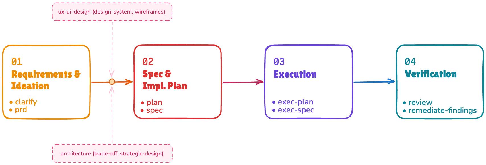
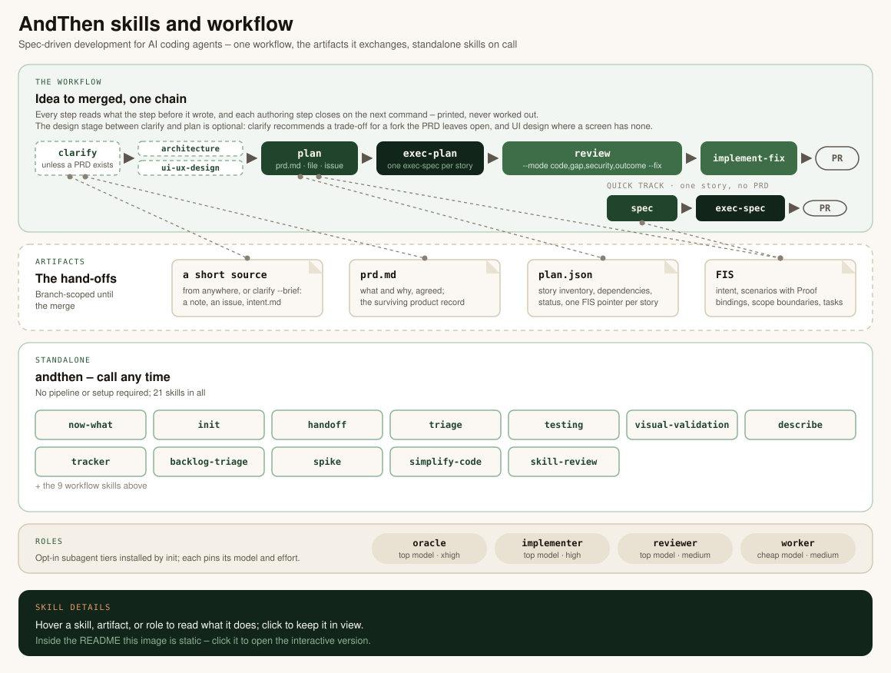

<p align="center">
  
</p>

<p align="center">
  <i>Lightweight spec-driven development for AI coding agents.</i>
</p>

> "I have a feature idea" → *and then?* → **clarify** → *and then?* → **plan** → *and then?* → **exec-plan** → *and then?* → **review** → **ship it.**
>
> Requirements already written – an issue, a PM doc? Skip **clarify** and start at **plan**.

Most AI coding goes straight from idea to code. That works for small fixes, but complex features drift, miss requirements, and produce code that is hard to verify. Spec-driven development adds one step: *write a spec first, then implement against it*. The spec is the contract – what to build, how to prove it, and when it is done. AndThen enforces that contract mechanically:

- **Nothing is done on its own say-so** – a story reaches `done` only together with a `verified` line quoting the output of what ran, written by the session that saw it run.
- **The reviewer wrote none of the code** – one fresh subagent reviews each story's implementation against the specification it implements, on every run.
- **Specs cannot rot** – the plan and its per-story specs govern one branch and are deleted before the merge; `prd.md` is what survives.
- **Ceremony is sized to the work** – a sentence-sized change skips the chain entirely (`implement-fix`), and every proposal is sized against the `Product` document's Proportionality facts.

AndThen ships as a Claude Code plugin, a Codex CLI plugin, and a loose-skill install for other agents – one plugin, `andthen`, with 21 skills. One runtime requirement, Python 3. No mandatory directories or proprietary formats: skills read a Project Document Index in your `CLAUDE.md` / `AGENTS.md` to find where specs, plans, and docs live.

<p align="center">
  <a href="assets/workflows-overview.png"></a>
</p>

<!-- pre-release: delete this warning when 1.0 is public -->
> [!WARNING]
> **1.0 is not on the public marketplace yet.** Until it is, the `IT-HUSET/andthen` commands on this page install 0.40.x from `main`. Install 1.0 from the [`develop` branch](#10-release-candidate-from-the-develop-branch) instead.

In a hurry?

```bash
# Claude Code
/plugin marketplace add IT-HUSET/andthen
/plugin install andthen            # the plugin
/andthen:init                      # set up your project
/andthen:now-what                  # ...and let it route you from there

# Codex CLI
codex plugin marketplace add IT-HUSET/andthen
codex plugin add andthen@andthen
```

Skills register under the same `andthen:<name>` ids on both hosts, and asking for one by name works everywhere: *Run the `andthen:init` skill*, then *Run the `andthen:now-what` skill*. The `/andthen:<name>` form used in the examples below is Claude Code's.

> [!NOTE]
> **1.0 is a breaking release.** Retired 0.x flags and skills have no compatibility aliases, and legacy Feature Implementation Specifications (FIS) must be re-specced before execution – [MIGRATING-FROM-0.x.md](MIGRATING-FROM-0.x.md) is the migration. AndThen is experimental by nature – agentic engineering is a young field – and skills change shape between minor versions.

Where to go next: what to type for your situation is the [Cookbook](COOKBOOK.md); every flag, mode, and edge case is the [skill reference](plugin/README.md#skills); arriving from 0.x starts at [MIGRATING-FROM-0.x.md](MIGRATING-FROM-0.x.md).


## The Workflow

<p align="center">
  <!-- pre-release: the raw link targets develop; point it at IT-HUSET/andthen/raw/main when 1.0 merges -->
  <a href="https://github.com/IT-HUSET/andthen/raw/develop/assets/skills-overview.svg"></a>
  <br><sub>Click the figure for the interactive version: hover a skill, artifact, or role to read what it does, click to keep it in view.</sub>
</p>

AndThen has one workflow, whether the work is one story or fifteen – the quick track below is the same chain with `spec` in place of `plan`. Every step reads what the step before it wrote, and every authoring step ends on the paste-ready next command, so what comes next is printed, never worked out.

```
clarify → plan → exec-plan → review --fix → PR
```

| Step | Skill | Reads | Writes |
|---|---|---|---|
| Setup, once per project | `init` | the repository | the Project Document Index in `CLAUDE.md` / `AGENTS.md`, and the Core orientation docs every later skill reads |
| 0. Requirements | `clarify` | your idea, or a source from anywhere – a pasted note, a tracker issue, an `intent.md` hand-written or from `clarify --brief` | `prd.md` – what to build and why |
| 1. Break down and spec | `plan` | a `prd.md` (or its directory), a requirements file, or a tracker issue | `plan.json` – the stories, their dependencies and status – plus one FIS per story |
| 2. Build | `exec-plan` | `plan.json` and every FIS | the code, one commit per story, each story `done` in `plan.json` |
| 3. Review | `review --mode code,gap,security,outcome` | `plan.json` – its PRD and FIS files – and the code | a review report beside `plan.json` |
| 4. Fix findings | `implement-fix` – or `--fix` on step 3, which runs it in the same pass | the review report | the fixes, and a `## Remediation Status` section in the report |
| 5. Merge | – | each FIS's `## Implementation Observations` | `plan.json` and the FIS files are branch-scoped: delete them before the merge; `prd.md` stays |

Step 0 is where the PRD comes from; skip it only when the requirements already exist as an issue or a document `plan` can take. `plan` always has a requirements source and decides the size itself: one story is a normal outcome, and the bundle shape does not change for it. The hand-offs are printed: `clarify` ends on the `plan` command, `plan` on `Closure: READY` and the `exec-plan` command, and `exec-plan` on a `Next:` line carrying steps 3–4 as one command for a fresh session. To drive the build by hand, run `exec-spec` per story – it is the same per-story unit `exec-plan` runs, see [Working in a team](#working-in-a-team); the tail is the same either way.

Two core skills change code without a spec: `triage` diagnoses and fixes a broken build, test, or runtime bug, and `implement-fix` makes a sentence-sized change with verification – the same skill that applies a review report's findings. `triage` never touches `plan.json`.

> **Not sure where to start?** Run `/andthen:now-what` – it inspects your project state and routes you. The [Cookbook](COOKBOOK.md) has a recipe per situation, opening with how to choose.

### Your four checkpoints

The workflow runs on its own between these four:

- **After `clarify`** – read `prd.md` before you run `plan`: it is what every story is cut from, and the one artifact that survives the merge.
- **After `plan`** – read `plan.json` and the FIS files. `Closure:` is the decision point: preflight settles each open decision with you or defers it, and a story still holding one is `blocked`, not `spec-ready`.
- **After `exec-plan`** – read the review report. `implement-fix` applies only the Fix-routed findings; Note findings are decisions left to you.
- **Before the merge** – graduate each FIS's `## Implementation Observations` into Learnings and Decisions, because the bodies go with the bundle.

### One story – the quick track

One story and no PRD: `spec <idea | issue-url>` writes the FIS and its one-story `plan.json` (`prd` is `null`) straight from the request, then `exec-spec <fis>` builds it and you open the PR. Same bundle shape as a plan's, so `exec-spec` and `review` behave identically. Take `plan` instead when the work is several stories, or when you want `prd.md` as the record that survives the merge; take `clarify` when the idea has too many unknowns to spec.

### The design stage

Between step 0 and step 1, two skills settle what the requirements left open, neither of them changing code: `architecture` (`--mode trade-off` compares competing options and settles an ADR; `--mode review`, `decompose`, `fitness`, `strategic-design`, and `event-storming` run the deep analysis and chain) and `ui-ux-design` (research, design systems, wireframes – validating a built UI is `visual-validation` instead). `clarify` recommends the first when the PRD leaves a design fork and the second when UI is in scope with no design system or wireframes; both are deliberate invocations.

### The artifacts – where each comes from, who reads it, how long it lives

| Artifact | Written by | Read by | Lifecycle |
|---|---|---|---|
| any short source – the intent doc `intent.md` is one shape | anyone, by hand: a pasted note, an issue, a sentence, or the five-section `intent.md`; `clarify --brief` writes that file | `clarify`, and `now-what`, `architecture` when it is a file on disk | superseded – the next `clarify` run folds its substance into `prd.md`, and nothing cites it by path afterwards |
| `PRODUCT.md` | `init`, or `clarify` at product scope | every proposal skill, as the proportionality anchor | durable, project-lifetime |
| `prd.md` | `clarify` | `plan`, `review --mode gap` | survives the merge – the product record |
| `plan.json` | `plan`, or `spec` for the one-story plan; runtime state by the run session alone | `exec-plan`, `exec-spec`, `review`, `now-what`, `tracker` | branch-scoped – deleted before the merge |
| FIS (one per story) | `spec`, standalone or through `plan` | `exec-spec` and `review` | branch-scoped – deleted before the merge |
| Review report | `review` | `implement-fix` | a working file of one review run – ignored or committed, the project's choice at `init` |
| `LEARNINGS.md`, `DECISIONS.md` | the agent that read them, at close-out and after triage | every skill at task start | durable, project-lifetime |

### The two loops

- **Outer loop, once per initiative** – `clarify → plan`: what and why, then sliced into stories with a FIS each.
- **Inner loop, once per story** – `spec → exec-spec → PR` on the quick track, `exec-spec → PR` under a plan: build one story and prove it, review included. `exec-plan` runs this loop for you, one story at a time in the shared tree, or independent stories in parallel under `--worktree`, one worktree each – a shared tree shares one test run.

This is a scope-and-cadence split, not the DevEx sense of inner loop (edit-build-test) versus outer loop (CI/CD). AndThen's third motion is the **knowledge cycle**, which is not a loop at all: FIS `Implementation Observations` graduate into `LEARNINGS.md` and `DECISIONS.md` at close-out, recurring review traps become lint rules or tests, and settled trade-offs become ADRs – so what one story learned, the next one starts from.

### Headless / automation mode

The pipeline and the standalone execution/review skills accept `--auto` for external orchestrators (CI, agent runners): no follow-up questions, conservative assumptions written into artifacts, and a hard `BLOCKED:` stop on contract failures or unsafe actions. See [plugin/README.md](plugin/README.md#workflows) for the contract.

### Terms

- **Story** – one bounded, verifiable unit of work that fits one fresh-context run, 1:1 with a FIS. `OVERSIZE:` means split it, not push on.
- **Plan bundle** – the feature directory holding `plan.json`, its FIS files, and `prd.md` when a PRD was the source.
- **FIS** – Feature Implementation Specification, one per story: intent and expected outcomes, acceptance scenarios with runnable `Proof` bindings, structural criteria, scope boundaries, the technical approach, and a task breakdown where each task names what it `SATISFIES` and how to `Verify` it.
- **Preflight / `Closure:`** – the closing round of `plan` and `spec` that settles every blocking open decision with you or defers it, ending on `Closure: READY` (with the next command) or `Closure: BLOCKED` (with the decisions still holding it).
- **fast / full tier** – the two verification tiers your project declares in its `Key Dev Commands` document. `exec-spec` runs the full tier, or the fast tier under `--no-full-tier` when `exec-plan` runs the full tier on the final tree.


## Installation

**Requirement: Python 3.** The one runtime AndThen needs: the tracker projection is a single stdlib script, so it behaves the same from Bash, Git Bash, PowerShell, and CMD. Without it, `andthen:init` reports `python3 not found → tracker projection unavailable` and continues.

<!-- pre-release: delete this section when 1.0 is public -->
### 1.0 release candidate from the develop branch

Until 1.0 ships on `main`, install from `IT-HUSET/andthen@develop` – it follows the release candidates, and auto-update works; `IT-HUSET/andthen@v1.0.0-rc.2` pins one instead. Both the 0.x and the 1.0 marketplace are named `andthen`, so remove the old one first; on Claude Code, removing a marketplace also uninstalls the plugin that came from it.

```bash
# Claude Code
/plugin marketplace remove andthen             # drops 0.x and its plugin
/plugin marketplace add IT-HUSET/andthen@develop
/plugin install andthen@andthen

# Codex CLI
codex plugin remove andthen@andthen
codex plugin marketplace remove andthen
codex plugin marketplace add IT-HUSET/andthen@develop
codex plugin add andthen@andthen
```

From a checkout of the branch, `python3 scripts/andthen-plugins.py --path .` does the same on both hosts in one step – it removes what is installed, installs the plugin, and verifies the version that landed. The release-line switcher below reaches this branch as its `rc` channel.

### The plugin install, host by host

The commands for both hosts are in the quick start at the top of this page. Beyond them:

- **Claude Code** – `/plugin install andthen --scope project` installs for the current project only; the default is user scope. Enable auto-update from `/plugin` → the **Marketplaces** tab → `andthen` → **Enable auto-update**.
- **Codex CLI** – skills register under the same `andthen:<name>` ids, and you invoke one by asking for it by name: *Run the `andthen:plan` skill on `docs/specs/data-export/`* – the form every AndThen skill prints as its own next command.
- Coming from a previous `install-skills.sh` install? Remove the old `~/.agents/skills/andthen-*` directories first – Codex shows duplicates (`andthen-review` and `andthen:review`) side by side otherwise.

### Other agents (Aider, Cursor, Gemini CLI, opencode)

The installer exports the plugin's skills under `andthen-`-prefixed names to your agent's skills directory, inlining the shared references so each bundle is self-contained. Invoke them with `$andthen-<skill>` in Codex and other `~/.agents/skills` readers.

```bash
./scripts/install-skills.sh                                # all skills (default: ~/.agents/skills)
./scripts/install-skills.sh --dry-run                      # preview planned operations
./scripts/install-skills.sh --skills clarify,spec,review   # a subset
./scripts/install-skills.sh --skills-dir <path>            # custom skills directory
./scripts/install-skills.sh --claude-user                  # also install for Claude Code at the user tier
```

A custom `--prefix` rewrites installed references and invocation names automatically – that is also how another toolkit [bundles AndThen in](plugin/README.md#bundling-into-a-downstream-toolkit) under its own namespace. Reinstalls replace owned matching skill bundles, removing stale files inside them, but do not infer or delete retired `<prefix>*` directories.

<!-- pre-release: at release `stable` is 1.0 – rename this heading (MIGRATING-FROM-0.x.md step 1 links its anchor), replace the `rc` channel with a 0.x pin in the script and below, and tag v0.40.4 on origin first so a ref leads back to 0.x -->
### Switching release lines (1.0 RC ↔ 0.x)

`scripts/andthen-plugins.py` (Python 3, no dependencies, macOS/Linux/Windows) drops the current installs, re-points the marketplace at the release line you name, installs again, and verifies the version landed in each host's cache. Both hosts install a plugin as a copy, so uninstall+install is what actually replaces it – `plugin update` compares version strings and will leave a stale copy in place.

```bash
curl -fsSL https://raw.githubusercontent.com/IT-HUSET/andthen/main/scripts/andthen-plugins.py | python3 - rc      # 1.0 release candidate
curl -fsSL https://raw.githubusercontent.com/IT-HUSET/andthen/main/scripts/andthen-plugins.py | python3 - stable  # 0.x (main)
```

On PowerShell, `irm <same-url> | python - rc`. Prefer to read before running? Save the file, inspect it, then `python3 andthen-plugins.py rc`. From a checkout, the same script takes `--path .` to reinstall from your working tree (the development refresh, which also diffs the installed copy against the source), `--ref <branch|tag>` for any other ref, and `--dry-run`, `--claude-only`, `--codex-only`. `rc` pins an immutable tag, so Claude Code's plugin auto-update keeps re-fetching that exact release candidate and you move to the next one by re-running the script; `stable` follows `main`.


## Setup

```bash
/andthen:init
```

The single entry point for new projects, partial setups, and existing codebases. It generates `CLAUDE.md` / `AGENTS.md` (for dual-tool projects: `AGENTS.md` canonical, `CLAUDE.md` a thin `@AGENTS.md` import), scaffolds the Core orientation docs (Product with its Proportionality facts, Architecture, Key Dev Commands with `fast` / `full` test tiers, Testing Strategy, Decisions, Learnings), and offers project-owned critical rules. For an existing codebase it offers `describe --mode codebase`, which generates the architecture and conventions docs from code analysis.

**Project-owned rules** – init recommends adopting critical rules directly in project `AGENTS.md` / `CLAUDE.md`, so they travel with the checkout into CI and containers. Teams can customize or skip them; rerunning init preserves both choices. Personal rules and the `concise-critical` conversation style are configured only on request. See [the setup reference](plugin/README.md#foundational-rules-and-conversation-style) for adoption, opt-out, and existing-copy handling.

**Manual setup** – skills read two sections from your root agent instruction file: a **Project Document Index** (each entry a document's location plus its read/update trigger) and **Project-Specific Guidelines**. [`CLAUDE.template.md`](plugin/skills/init/templates/CLAUDE.template.md) is the starter.


## Your first feature

Run `/andthen:init` once per project – it writes the Project Document Index every later skill reads. Then, from an idea to a merged PR:

```bash
/andthen:clarify "users should be able to export their data"   # interviews you, writes docs/specs/data-export/prd.md
/andthen:plan docs/specs/data-export/                          # fresh session: plan.json + one FIS per story
/andthen:exec-plan docs/specs/data-export/                     # fresh session, once plan printed Closure: READY
/andthen:review --mode code,gap,security,outcome --fix docs/specs/data-export/plan.json   # the Next: line exec-plan prints
```

The first command is a conversation: `clarify` asks in rounds (scope, flows, edge cases, success criteria) until the requirements are settled, and a small feature takes one round. The rest runs on its own between [the four checkpoints](#your-four-checkpoints).

One story and no PRD? `/andthen:spec "users can export their data"` writes `docs/specs/data-export/s01-data-export.md` and its one-story plan, then `/andthen:exec-spec docs/specs/data-export/s01-data-export.md` builds it. A change you can state in one sentence needs neither: `/andthen:implement-fix "return 404 instead of 500 for an unknown export job id"`.

**When to clarify.** `plan` always needs a requirements source, and that is the whole rule: an issue or a document that already states the requirements goes straight to `plan` – or to `spec` when it is one story and you want no PRD. If you cannot list three concrete acceptance criteria, you have an idea, not requirements, and `clarify` is what turns it into the `prd.md` `plan` then reads.

The cookbook walks one initiative end to end, with the artifacts and the completion report each step produces: [the worked example](COOKBOOK.md#the-worked-example-workspace-invitations). Unsure which path is yours? [Choosing a path](COOKBOOK.md#choosing-a-path).


## Working in a team

The pipeline does not change per tracker; the tracker is a projection of the plan, never a second source of truth. Five steps:

1. **A request arrives** as a tracker item – one line or a long brief.
2. **Outer loop, once per epic** – `clarify <item-url>` → `prd.md` (with a `> **Source**:` provenance line) → `plan` → `plan.json` + a FIS per story → **PR to the milestone branch**. An item that already states its requirements goes straight to `plan <item-url>`. The team reviews the PRD and the plan there.
3. **Publish the breakdown** – `tracker publish plan.json` creates one parent issue and one child issue per story (scope, PRD anchors, a commit-pinned FIS link, blocked-by links, completed task IDs, owner). A canonical repository-relative marker makes re-runs update instead of duplicating and blocks ambiguous duplicate matches.
4. **Inner loop, once per story** – pick the story's issue → claim it (the story's `owner`) and branch (`{type}/{story-id}-{slug}`) → `exec-spec`, review included → PR with `Closes #N`. Merge closes the issue natively; no skill involved.
5. **State** – `plan.json` is agent truth while the plan governs, written by the run session alone; the tracker is the human projection (re-run `tracker publish` to refresh it; the projection is one way, repo → tracker). `prd.md` outlives the bundle; the issues and the PRs are the per-story record.

A single story is the same flow with a different argument:

| Step | Local files | Tracker |
|---|---|---|
| Request | any short source – inline, a file, or the `intent.md` `clarify --brief` wrote | issue URL / key |
| Spec | `spec <source>` → the FIS plus its one-story plan on the feature branch | `spec <issue-url>` → same bundle; `sourceRefs` cite the URL |
| Build + prove | `exec-spec`, review included → PR | same; PR body `Closes #42` |
| Status | branch + PR | native: branch name / PR link moves the issue, merge closes it |
| Record after merge | the PR and commits (the FIS head rides the squash-merge message) | the issue and the PR |
| Close-out | the bundle is deleted before the merge | same |

The requirements record differs: a PRD source leaves `prd.md` behind; the quick track and an issue-sourced bundle leave the request itself – `prd` is `null` in the plan, and `sourceRefs` cite the source. Concurrency needs no shared state file: `plan.json` is the one state owner, and per-story FIS prose is frozen and naturally partitioned.


## Skills

Flags, modes, and edge cases: [the skill reference](plugin/README.md#skills).

| Skill | Purpose |
|---|---|
| `init` | Set up the workflow structure – `CLAUDE.md` / `AGENTS.md`, the Project Document Index, the Core orientation docs, the foundational rules guideline |
| `now-what` | First-stop router – inspects project state and routes to the right skill |
| `clarify` | The requirements skill – Discovery & Ideation at feature or product scope, landing in `prd.md` (or `PRODUCT.md`) after fresh-context self-review; a hand-written `intent.md` is one input it folds in, and `--brief` stops at that same `intent.md` instead – a feature before its PRD, or any decision or proposal to sharpen and share |
| `plan` | Validated plan bundle from a PRD, a requirements file, or a tracker item: `plan.json` + a FIS per story, cross-cutting review, one preflight |
| `spec` | The FIS for one feature or one plan story, with the durable-state check, self-review, and preflight |
| `exec-spec` | Implement one FIS where invoked: its own proofs → one quick reviewer subagent → full verification → the story's `done` record |
| `exec-plan` | Run a plan bundle: one fresh `exec-spec` subagent per story, then the full tier, then hand the plan-level code/gap/security review to a fresh session |
| `review` | Proof-led `code` / `gap` / `security` / `outcome` review and PR review; a story's own review is one `--quick` pass |
| `implement-fix` | A small feature or fix from a request, or a review report's Fix-routed findings, with verification – no spec |
| `triage` | Investigate, diagnose, and fix build failures, config errors, runtime bugs, regressions, test failures |
| `testing` | Test strategy (writes the `Testing Strategy` document), test authoring, TDD, and the Prove-It bugfix flow |
| `handoff` | Compact the conversation into a document a fresh session resumes from; durable fragments written to the plan and the Learnings document |
| `architecture` | Seven modes: `trade-off` settles an ADR from weighted options, `advise` gives design guidance, and `review`, `decompose`, `fitness`, `strategic-design`, `event-storming` run the deep analysis, singly or chained. No code changes |
| `describe` | Describe what a project already is – `--mode codebase` maps it into docs, `--mode domain` extracts the Ubiquitous Language; `--model` emits the typed atlas model |
| `ui-ux-design` | UX research, design systems, and wireframes |
| `visual-validation` | Validate screenshots and built UI against wireframes, design specs, and baselines; `--mode setup` writes the project's `Visual Validation` document once |
| `tracker` | Project a plan bundle into the issue tracker – `publish` creates the parent and child issues and refreshes them on a re-run |
| `spike` | Answer one design question by building a throwaway spike and reporting a verdict |
| `simplify-code` | Behavior-preserving simplification – less complexity, less over-engineering |
| `skill-review` | Review one skill bundle or prompt-like file against skill craft – findings and a ship-ready verdict; `--fix` tightens it with zero contract loss |
| `backlog-triage` | Label, categorize, and route untriaged tracker items toward implementation or a human decision |

**Security depth.** `review --mode security` calibrates severity by exposure tier and runs the project's own scanners; the standing reference material it deliberately does not ship – OWASP's cheat-sheet series, semgrep's own rule registry – is where to go deeper on a given surface.


## Coming from Spec Kit, Kiro, or BMAD

**Where AndThen sits.** It is spec-first with programmatic enforcement. While the plan governs, `sourceRefs` and `SATISFIES` backlinks trace requirements to stories and tasks, and a story reaches `done` only with the one line naming what was run to prove it. The boundary is deliberate: a team whose obligation is audit-grade permanent spec traceability – a regulator, a requirement→test matrix that must outlive the merge – needs a spec-anchored tool that keeps the spec alive after merge. AndThen keeps governing artifacts branch-scoped.

**Reading across frameworks.** Every spec-driven toolchain names the same three layers differently, and "spec" is the word they disagree on hardest. The bridge:

| Layer | Anthropic's AI-native SDLC playbook | GitHub Spec Kit | AWS Kiro | BMAD | AndThen |
|---|---|---|---|---|---|
| Intake – the problem, before anyone commits to solving it | `intent.md` | – | – | project brief | any short source – the intent doc `intent.md` is one shape |
| Requirements – what to build and what counts as done | `spec.md` | `spec.md` (replaces the PRD) | `requirements.md` | PRD | `prd.md`, written by `clarify` |
| Design and breakdown – files, order, risks, proof | `plan.md` | `plan.md` + `tasks.md` | `design.md` + `tasks.md` | architecture doc + story files | one FIS per story + `plan.json` |

The row that trips people up is the second: AndThen's "spec" is the FIS, and it sits **downstream** of the PRD rather than replacing it. Arriving from Spec Kit, you will map it one layer too high.

**What the critiques ask for.** The standing critique of spec-driven development is that a spec written up front assumes implementation teaches nothing, and that an agent asked to verify its own work will certify it. Beyond the four mechanisms at the top of this page:

- **Learning during implementation** – requirements found mid-execution are appended through the FIS's Discovered Requirements channel before the code that needs them, and deliberate divergence is a Drift Note. Both graduate into `LEARNINGS.md` / `DECISIONS.md` at close-out.
- **Agents reviewing their own work** – the story's executor implements the FIS and runs its proofs; the fresh reviewer subagent takes the story's attestation as the claims to falsify. Nothing completes on its author's own reading of it.
- **Repeat incidents** – a reproducible bug gets a failing test before the fix, so the fix has something that fails without it.


## Upgrading from 0.x

1.0 removes the retired 0.x command surface with no compatibility aliases, and legacy FIS files must be re-specced through the `andthen:spec` skill before execution. Make a clean commit or another recoverable copy first.

[MIGRATING-FROM-0.x.md](MIGRATING-FROM-0.x.md) is the migration: what changed in the model, the four steps, a two-pass prompt that inventories your project before touching anything, and the disposition of every retired skill, agent, flag, operation, and artifact.


## Docs

- [`COOKBOOK.md`](COOKBOOK.md) – one recipe per situation, plus a continuous worked example from rough request to the milestone PR.
- [`plugin/README.md`](plugin/README.md) – the skill reference: flags, modes, edge cases.
- [`docs/ARCHITECTURE.md`](docs/ARCHITECTURE.md) – the plugin layout, shared references, document ownership, conversation boundaries.
- [`docs/PRODUCT.md`](docs/PRODUCT.md) – goals, non-goals, and how AndThen weighs verification against the cost of ceremony.
- [`docs/MODEL-EFFORT-SELECTION-GUIDE.md`](docs/MODEL-EFFORT-SELECTION-GUIDE.md) – model and thinking-effort selection.
- One starter guideline ships with AndThen – `CRITICAL-RULES-AND-GUARDRAILS.md`, offered by `init` directly in an adopting project's instruction file, where the team owns its copy. All other guidelines are project-authored.
- Beyond AndThen: [Agent Browser](https://github.com/vercel-labs/agent-browser) (CLI tool and skill), and from the official marketplace ([anthropics/claude-plugins-official](https://github.com/anthropics/claude-plugins-official)) [`semgrep`](https://github.com/semgrep/mcp-marketplace) (external, officially recommended), `playground`, and `claude-md-management`.


## Hooks

Four optional standalone Claude Code hooks, none of them required by the workflow: blocking destructive shell commands, desktop and ElevenLabs voice notifications, and re-injecting critical rules after context compaction. See [`hooks/README.md`](hooks/README.md) for the scripts, their events, and setup.


## Evolved From

AndThen evolved from [cc-workflows](https://github.com/tolo/claude_code_common) – a general-purpose AI coding agent toolkit.


## Inspired by _(name)_

[](https://www.youtube.com/watch?v=oqwzuiSy9y0)

and then

[](https://www.youtube.com/watch?v=fPzvUW8qaWY)


## Actually inspired by

Too many to list, but special shoutout to:
- [Peter Steinberger](https://github.com/steipete)
- [Cole Medin](https://github.com/coleam00) – the two loops above are his outer/inner split, and the habit of saying per hand-off whether to continue or start fresh
- [IndieDevDan](https://github.com/disler)
- [Matt Maher](https://github.com/bladnman)
- [Mario Zechner](https://github.com/badlogic)
- [Matt Pocock](https://github.com/mattpocock)


## License

MIT
